=============
FPGA Input
=============

This section will document FPGA input for Rapid Power Estimator.

To begin inputting FPGA information, the user must have an RTL design that they would like to run on an FPGA platform. For users who have used other FPGA vendors' EDA tools, they can directly enter the FPGA input using their estimated FPGA utilization. 

For new FPGA users, we reccommend first running their RTL design on Raptor Design Suite. Raptor will provide the user with a utilization report to help fill out RPE's FPGA input sections.

Clocking
#########

The clocking section is located on the top left of the FPGA input section.

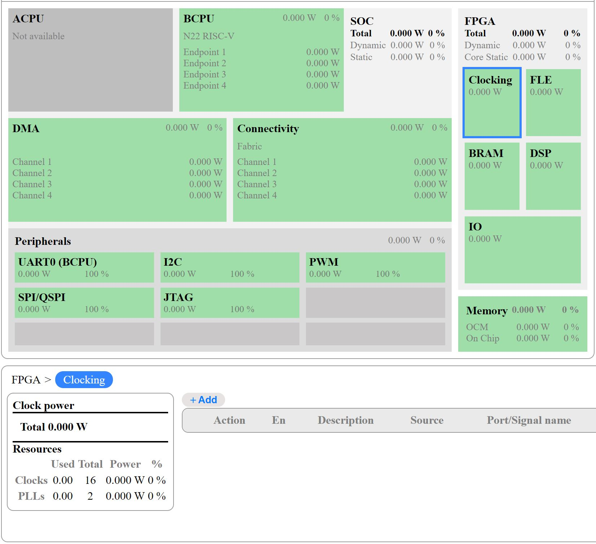

Selecting the clocking section will display an empty table at the botton of the screen, click the "+Add" button above the table to fill out clock information.

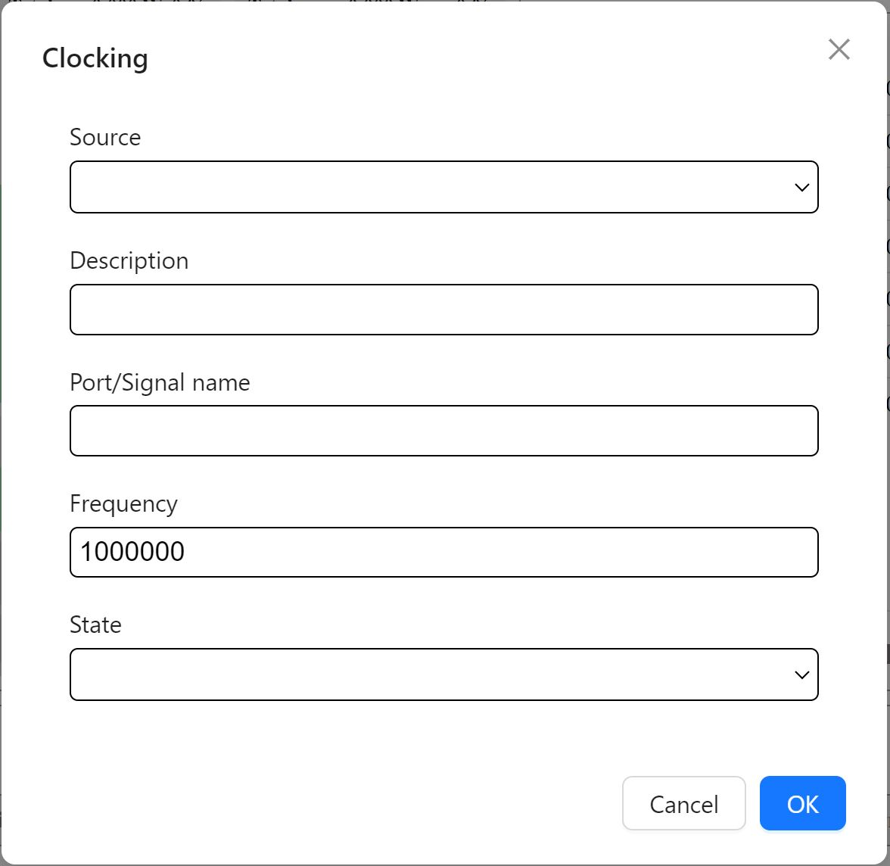

1. Select the clock source using the source dropdown menu
2. Provide a description *(optional)* 
3. Enter the Port/Signal name of the clock, *Note: Clock info will be required by all RPE sections, naming should be done clearly to be able to select the correct clocks.*
4. Enter the clock frequency 
    #. For **Boot Clock** & **RC Oscillator** sources refer to your device's datasheet and enter frequencies accordingly.
5. Select the Clock State - default is **active**
    #. Active for regular clock signals
    #. Gated for unused not actively toggling or gated off signals

Repeat the steps above for each clock used in the RTL design.

FLE - Fabric Logic Element 
###############################

The FLE section is located on the top right of the FPGA input section.

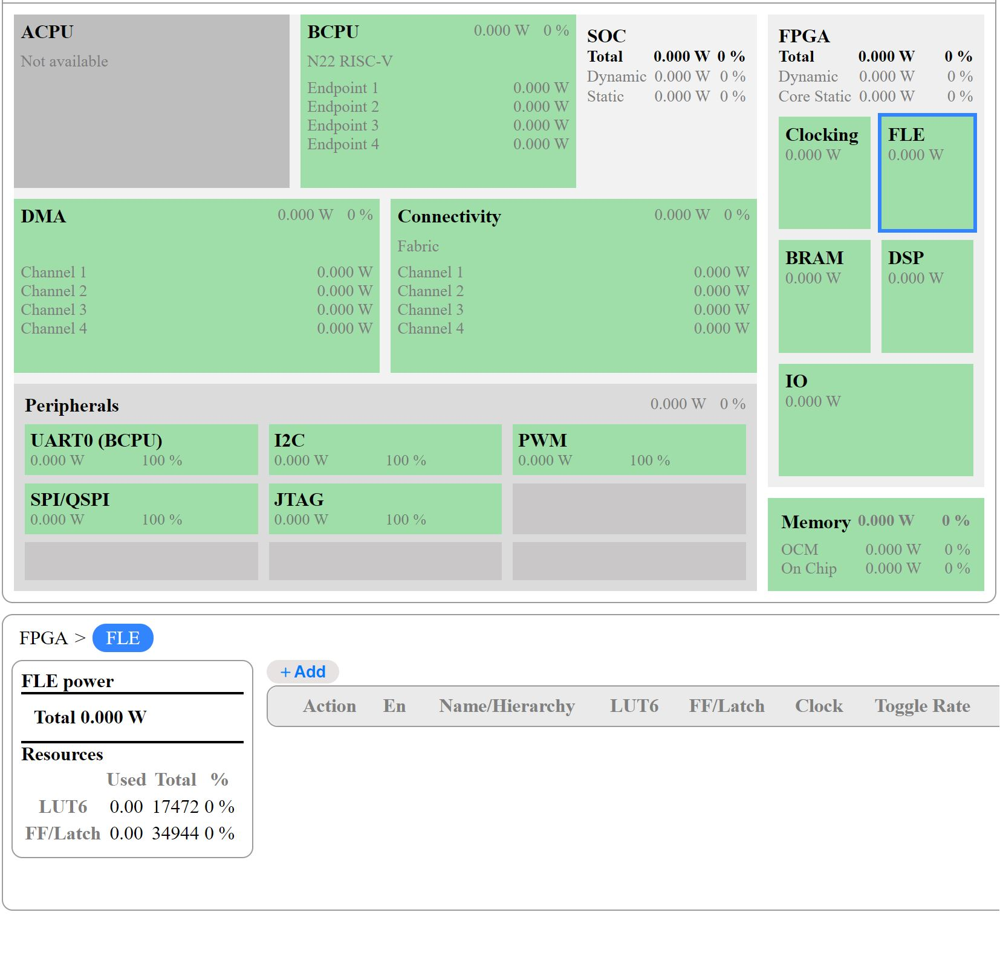

Selecting the FLE section displays an empty table at the botton of the screen, click the "+Add" button above the table to fill out the FLE info.

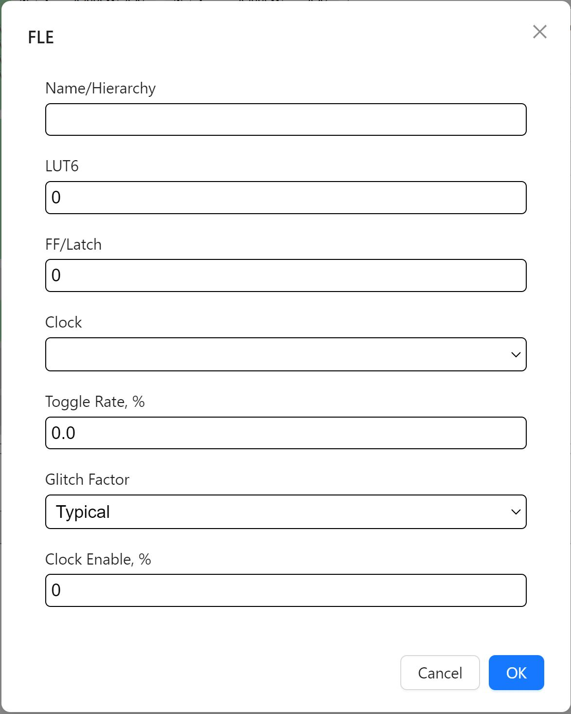

1. Enter the name of your RTL module from your project's hierarchial view. *Note: You can leave this blank if you are providing FLE info for the entire design at once.* 
2. Enter the no. of LUTs 
3. Enter the no. of flip-flops
4. Click on the clock dropdown, select the main clock responsible for running the design. 
5. Enter toggle rate - Industry standard default is **12.5%** 
6. Select glitch factor - default is **typical**
    #. Typical - Default option, for standard designs.
    #. High - For designs with high switching activity or complex logic.
    #. Very High - For high performance designs with high-frequency logic or heavy use of pipelining.
7. Enter clock enable rate - Inudustry standard default is **50.0%**

BRAM - Block Randon Access Memory 
##################################

The BRAM section is located directly below the clocking section.

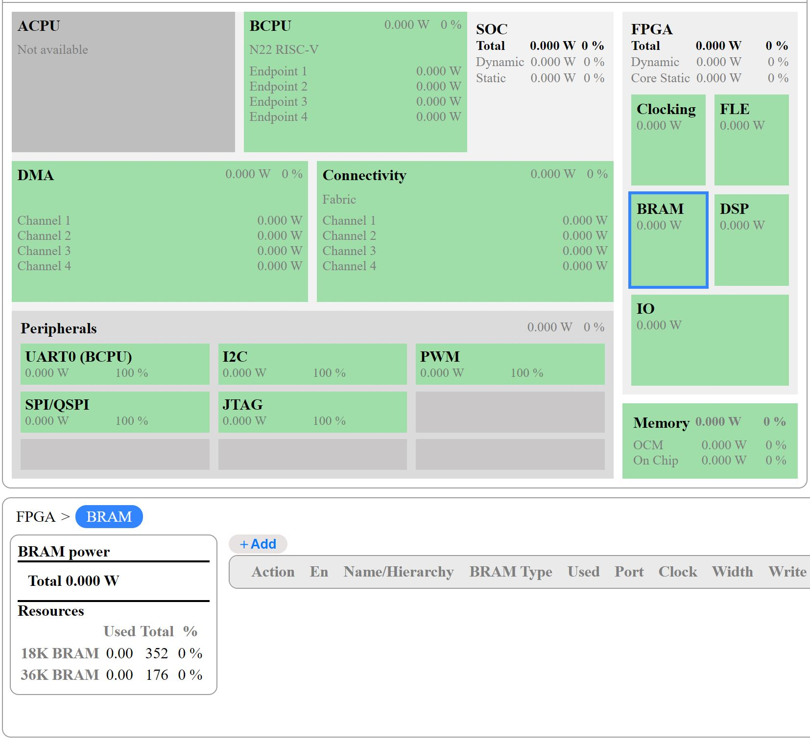

Selecting the BRAM section displays an empty table, click the "Add" button above the table to fill out the BRAM info.

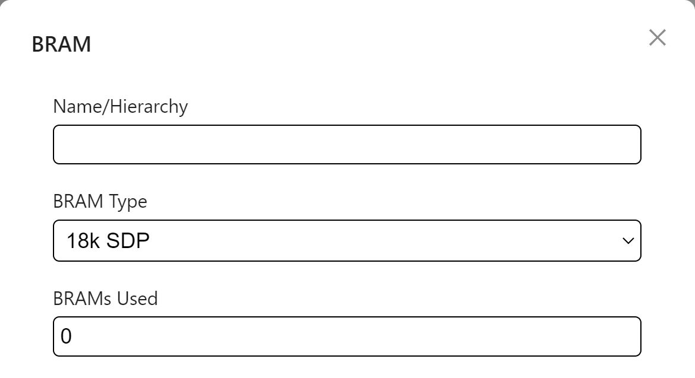

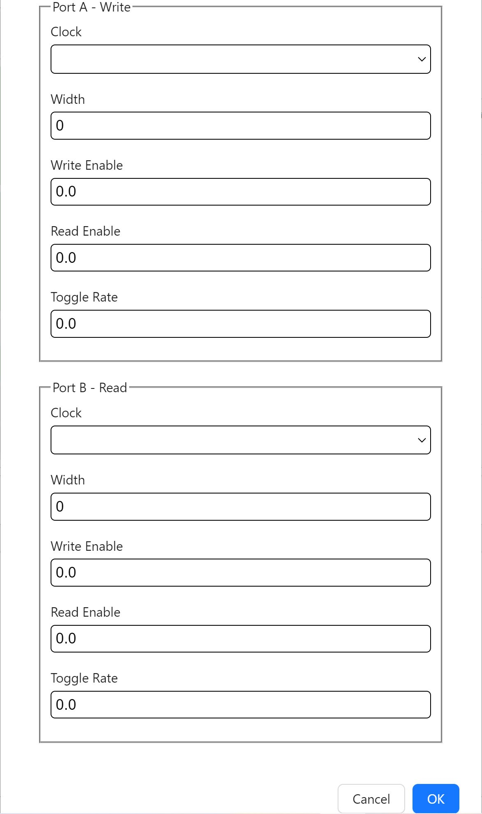

1. Provide a name to label the BRAM function within the hierarchy (optional)
2. Select the type of BRAM used in the RTL design
3. Enter the no. of this type of BRAM used in the design 
4. Enter Port A-White & Port B-Read info based on the type of BRAM selected
    #. Clock - Select the clock which will be used to drive the BRAM Port
    #. width - Enter BRAM's channel width, default is **16**
    #. Write enable - Select based on BRAM type, default is **50% for SDP port A**
    #. Read enable - Select based on BRAM type, default is **50% for SDP port B**
    #. Toggle Rate - Industry standard default is **12.5%**

DSP - Digital Signal Processor
###############################

The DSP section is located directly below the FLE section.

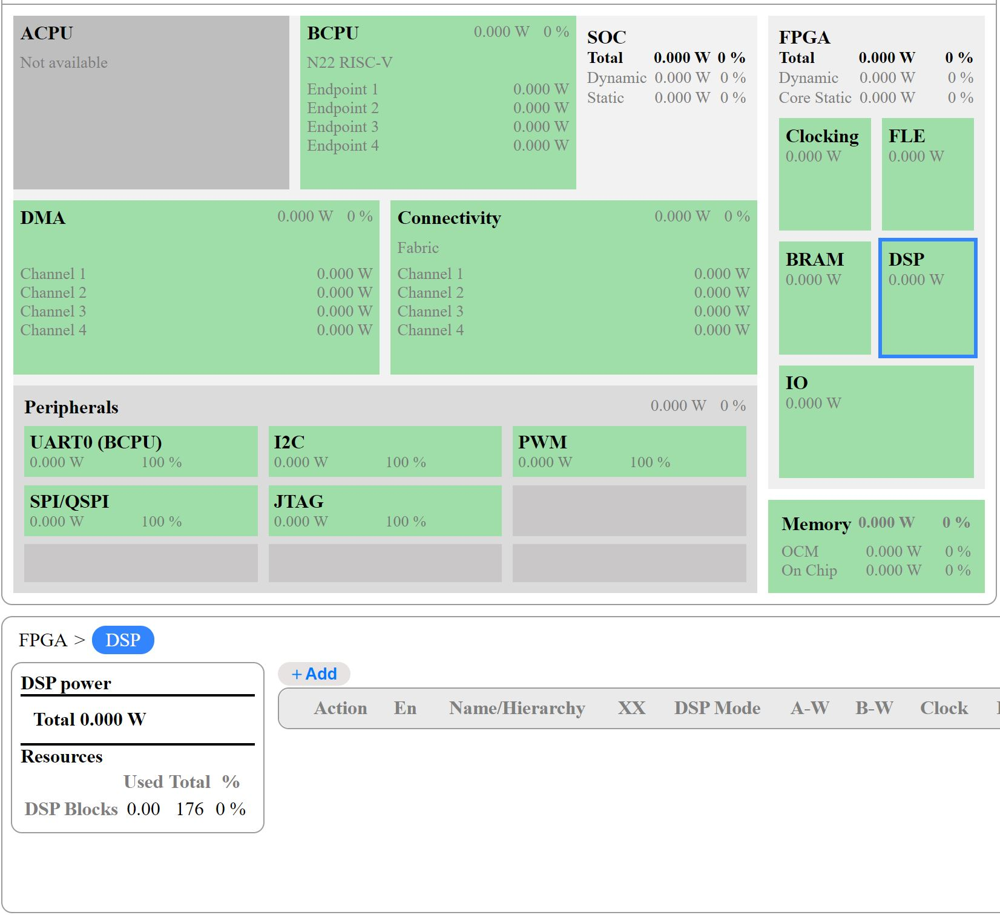

Selecting the DSP section displays an empty table, click the "Add" button above the table to fill out the DSP info.

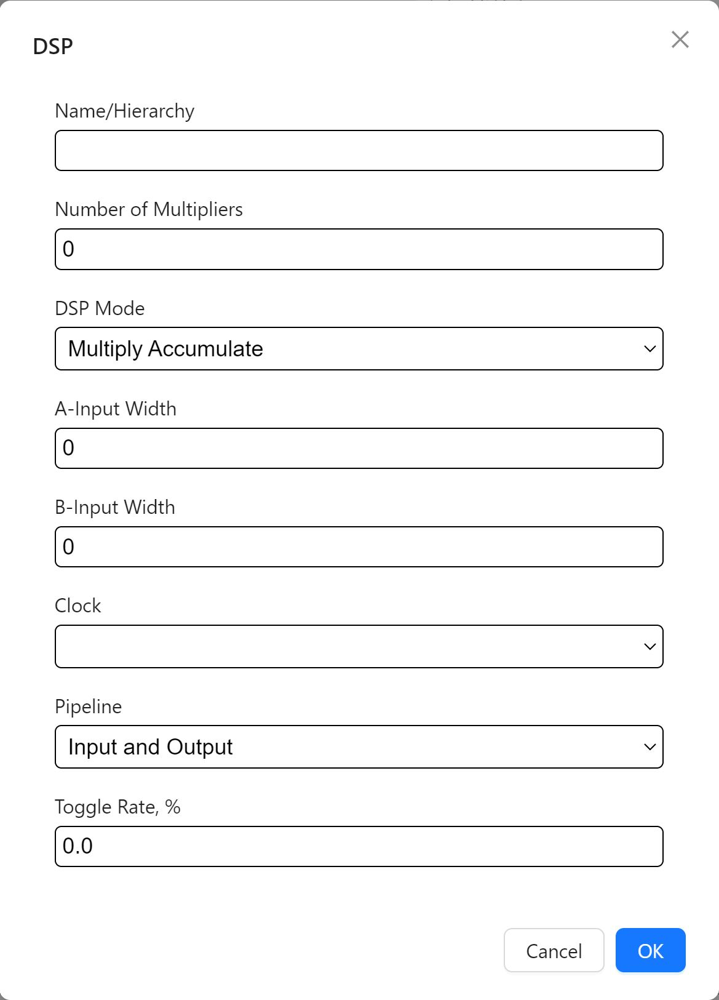

1. Provide a name to label the DSP function within the hierarchy (optional)
2. Enter the no. of DSP multipliers 
3. Select the DSP's mode from the dropdown menu
4. Enter channel width for DSP inputs, *Note: The DSP Block is 20x18*
     #. Input-A width must be between **1 & 20**
     #. Input-B width must be between **1 & 18**
5. Select a clock to drive the DSP
6. Select the pipeline type 
7. Enter toggle rate - Industry standard default is **12.5%**

IO - Input/Output
##################

The IO section is located the botton of the FPGA input section.

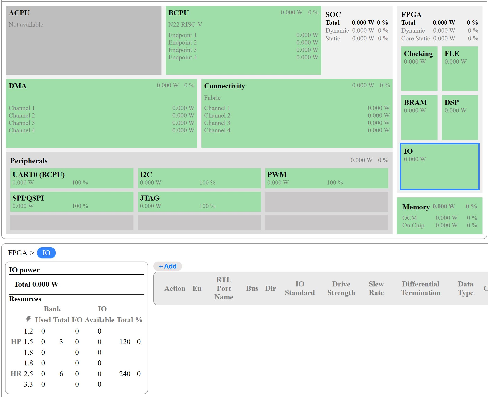

Selecting the IO section displays an empty table, click the "Add" button above the table to fill out the IO info.

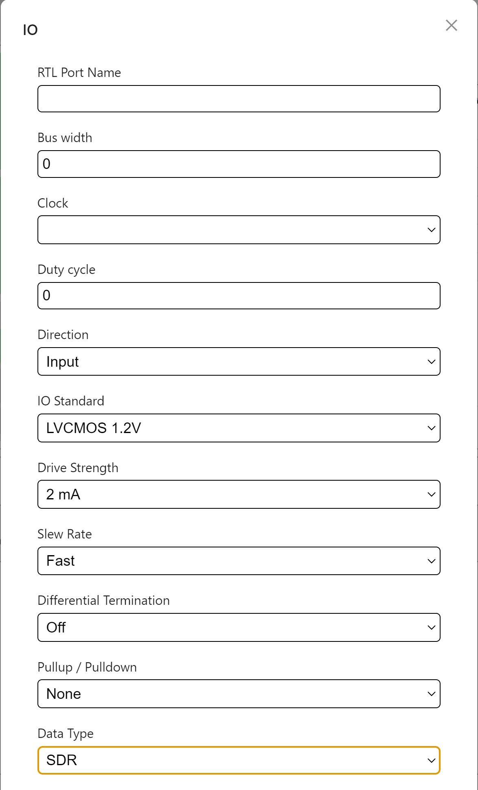

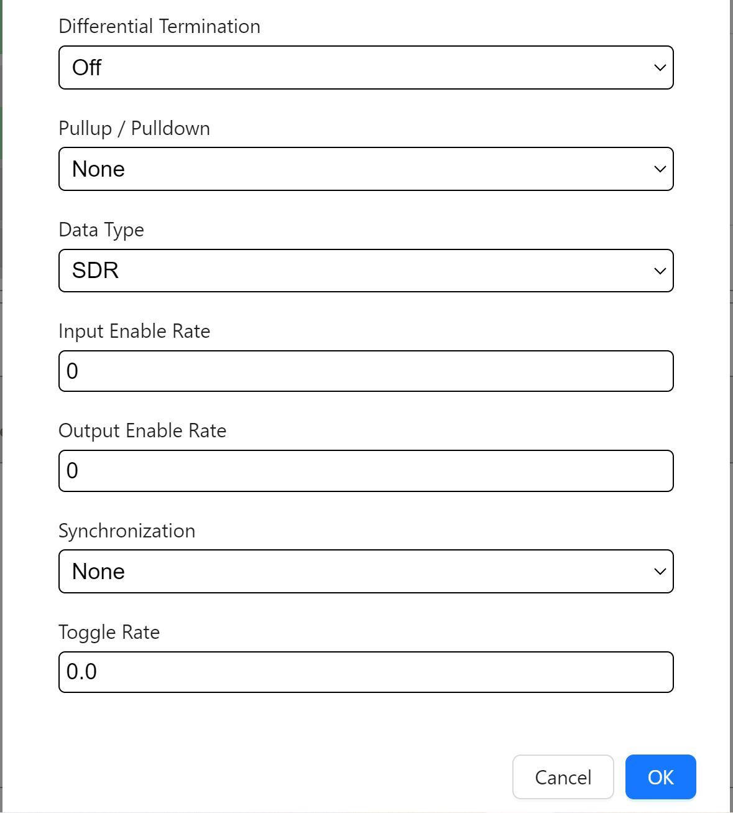

1. Provide an IO port name 
2. Enter the IO's bus width
3. Select main RTL clock to drive the IO
4. Enter duty cycle - Inudustry standard default is **50.0%**
5. Select IO direction 
    #. Input 
    #. Output
    #. Open-Drain
    #. Bi-Directional
6. Select IO standard - **LVCMOS 1.8v (HR)** as default
7. Select drive strength - current the output buffer can supply to drive a signal through the connected load
8. Select slew rate - how quickly the output signal transitions between logic levels
    #. Fast - for high-speed signals
    #. Slow - for lower power designs
9.  Turn differential termination on/off - **off** as default
10. Select pullup/pulldown resistors - **None** as default
11. Select data type - default is **SDR**
     #. SDR (Single Data Rate)  
     #. DDR (Double Data Rate)
     #. Clock
     #. Asynchronus 
12. Enter input enable rate - default is **50%** for inputs
13. Enter output enable rate - default is **50%** for outputs 
14. select synchronization option - default is **none** for signals that are already clocked and don't cross domains
15. Enter toggle rate - Industry standard default is **12.5%**

