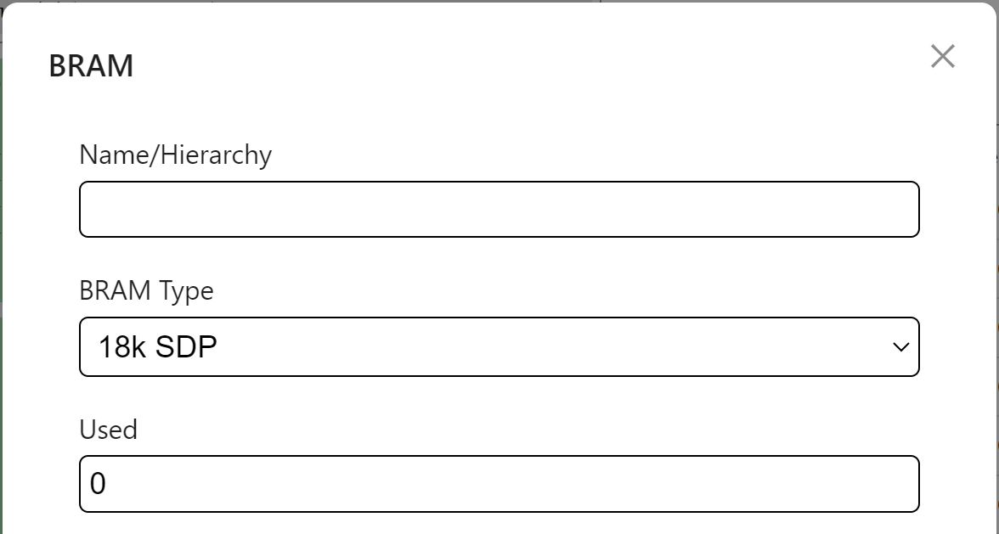
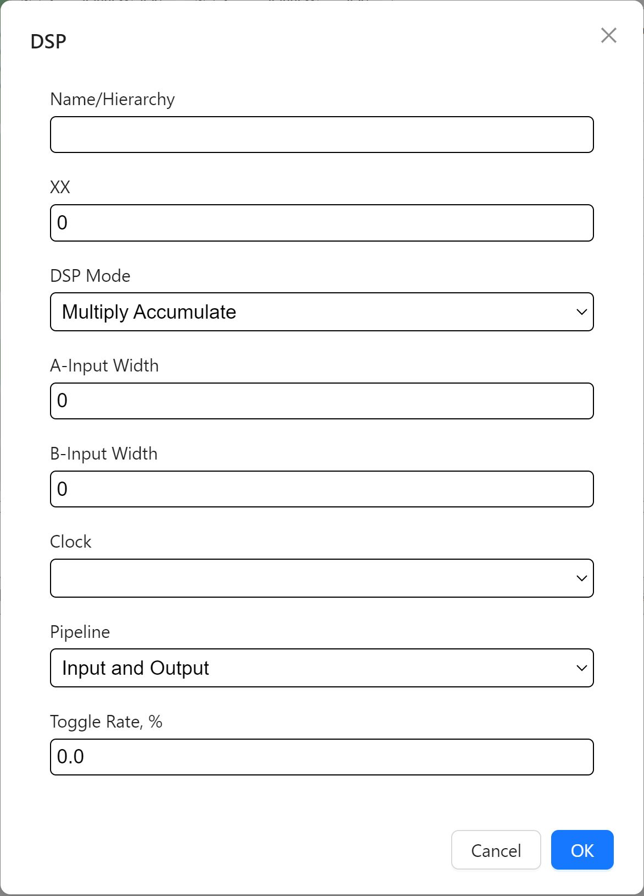

=============
FPGA Input
=============

To begin inputting FPGA information, the user must have an RTL design that they would like to run on an FPGA platform. For users who have used other FPGA vendors' EDA tools, they can directly enter the FPGA input using their estimated FPGA utilization. 

For new FPGA users, we reccommend first running their RTL design on Raptor Design Suite. Raptor will provide the user with a utilization report to help fill out RPE's FPGA input sections.

Clocking
#########

The clocking section is located on the top left of the FPGA input section.

.. image:: figures/FPGA-figures-clocking-clocking_selected.JPG

Selecting the clocking section will display an empty table, click the "Add" button above the table to fill out clock information.

.. image:: figures/FPGA-figures-clocking-input_clock_info.JPG

Select the clock source using the source dropdown, then provide a description (optional) and name for the clock. Enter the clock frequency and lastly it's state. Repeat the following steps for each clock used in the RTL design.

FLE - Functional Logic Element 
###############################

The FLE section is located on the top right of the FPGA input section.

.. image:: figures/FPGA-figures-FLE-FLE_selected.JPG

Selecting the FLE section displays an empty table, click the "Add" button above the table to fill out the FLE info.

.. image:: figures/FPGA-figures-FLE-input_FLE_info.JPG

Enter the no. of LUTs & flip-flops, then select the main clock from the clock dropdown. Lastly enter toggle rate, glitch factor and clock enable rate. 

BRAM - Block Randon Access Memory 
##################################

The BRAM section is located directly below the clocking section.

.. image:: figures/FPGA-figures-BRAM-BRAM_selected.JPG

Selecting the BRAM section displays an empty table, click the "Add" button above the table to fill out the BRAM info.

.. image:: figures/FPGA-figures-BRAM-input_BRAM_ports_info.JPG

Select the type of BRAM used on the RTL design, then the no. of that type of BRAM used. 

Next fill out the read & write ports info. For each, select the clock, enter port width and senter write enable, read enable as well as toggle rates.

DSP - Digital Signal Processor
###############################

The DSP section is located directly below the FLE section.

.. image:: figures/FPGA-figures-DSP-DSP_selected.JPG

Selecting the DSP section displays an empty table, click the "Add" button above the table to fill out the DSP info.

Ener the no. of DSP multipliers used, select the DSP's mode, enter channel width for all inputs, select a clock, then select the pipeline type and enter toggle rate.

IO - Input/Output
##################

The IO section is located the botton of the FPGA input section.

.. image:: figures/FPGA-figures-IO-IO_selected.JPG

Selecting the IO section displays an empty table, click the "Add" button above the table to fill out the IO info.

.. image:: figures/FPGA-figures-IO-input_IO_info1.JPG

.. image:: figures/FPGA-figures-IO-input_IO_info2.JPG

Enter I/O port name, bus width, select clock, enter duty cycle, select IO direction & standard, drive strength (current in Amperes), slew rate, differential termination, pullup/pulldown resistors, data type, enter input enable rate, output enable rate, select synchronization & enter toggle rate

