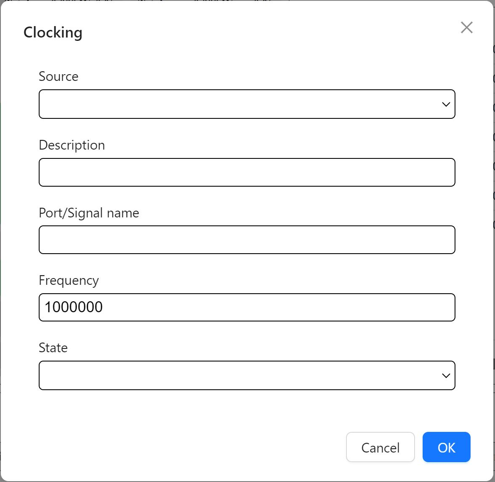

=============
FPGA Input
=============

This section will document FPGA input for Rapid Power Estimator.

Clocking
#########

.. image:: figures/FPGA-figures-clocking-input_clock_info.JPG
   :width: 300px
   :align: center
   :height: 350px
   :alt: Setup Diagram

FLE - Functional Logic Element 
###############################

BRAM - Block Randon Access Memory 
##################################

DSP - Digital Signal Processor
###############################

IO - Input/Output
##################