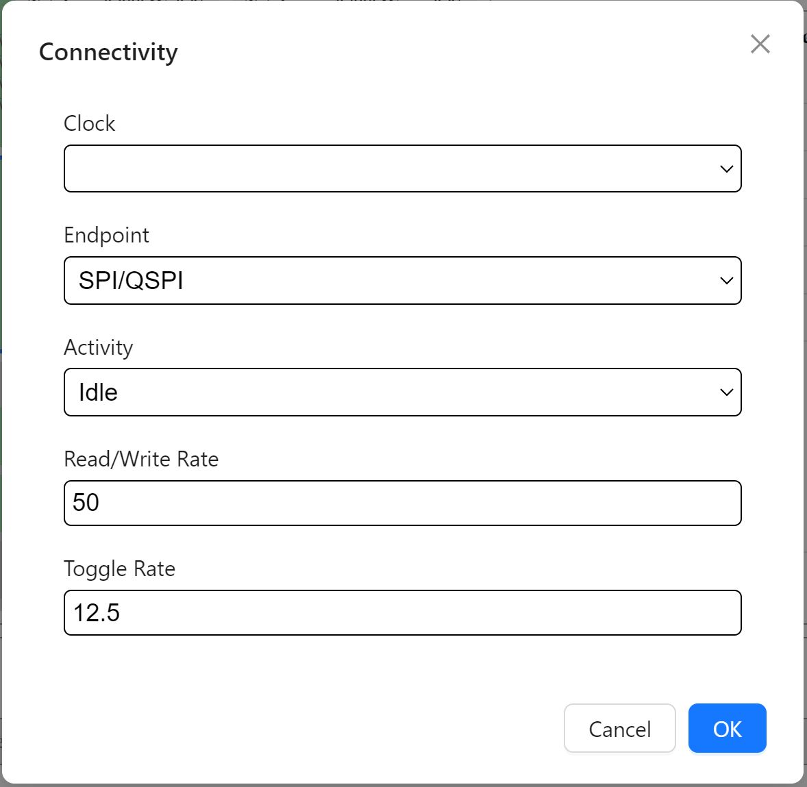

=============
SoC Input
=============

This section will document SoC input for Rapid Power Estimator.

Peripherals
###########

To begin inputting SoC information the user must start with selecting peripherals needed for boot, debug & application. The peripherals input section is located on the bottom of the input interface. 

Selecting the Peripheral section will display a list of available peripherals on the target device. 

Use the checkboxes on left side to enable/disable peripherals.
Then click on each enabled peripheral's action column button to configure the peripheral. 

For each peripheral, select it's usage as well as performance. 

*Note:* For PWM, selecting an IO is also required to drive the PWM signal.

BCPU - Boot Central Processing Unit
#######################################

The BCPU section is found at the top of the SoC input section, to the left of the SoC Total power display.

Selecting the BCPU section will display the name of the CPU "N22 RISC-V", followed by it's configuration fields.

Enable/Disable encryption using the checkbox.

Select Boot Mode, SPI is selected by default. 
*note:* SPI is currently the only available mode.

Select Clock, BOOT CLK is selected by default.

Click on the "Add" button to connect peripherals with BCPU. These will be primarily used for debug and accessing memory.

Select peripheral under the "Endpoint" dropdown, then enter it's active state, Read/Write Rate & Toggle Rate. Repeat this step for each peripheral.

Connectivity
############

The Connectivity section is found below the BCPU section & SoC Total power display.

Selecting the Connectivity section will display an empty table, click on the "Add" button above the table to connect peripherals to the FPGA fabric.

For each peripheral, first pick one of the clocks inputted from the FPGA clocking section. 

Under the Endpoint dropdown, select the peripheral to connect to the FPGA fabric, followed by active state, read/write rate & toggle rate. Repeat for each FPGA fabric connection needed.

Memory
########

The memory section is found below the FPGA input section.

Selecting the memory section will display a table below with the available memory options, click the "Add" button above the table to configure each memory.

For each memory, select it's usage, then Memory Type, followed by required Data Rate & channel width. 

*Note:* All devices will have OCM - on chip memory, DDR memory is only available on specific devices.

ACPU - Application Central Processing Unit
###########################################

The ACPU section is found on the top left of the SoC input display. 

Selecting the ACPU section will display the name of the CPU, followed by it's operating frequency & Load selection. *Note:* Application CPU is not available on all devices.

Toggle the ACPU Power toggle switch on left hand side to enable ACPU, then select the load required from the Load dropdown. 

Click the "Add" button above the empty table to connect peripherals to the ACPU.

For each peripheral, select peripheral under Endpoint, then select active state, read/write rate & toggle rate. 

DMA - Direct Memory Access
###########################

The DMA section is found below the ACPU section, clicking it will display a 4 channel table on the display.

Enable/disable each channel using the checkboxes under the Enable column, then click on the action column buttons to configure the channel connections.

For each channel, select a source & destination, typically a peripheral will be connected to a memory or vice-versa. Then select the active state, read/write rate & toggle rate.

