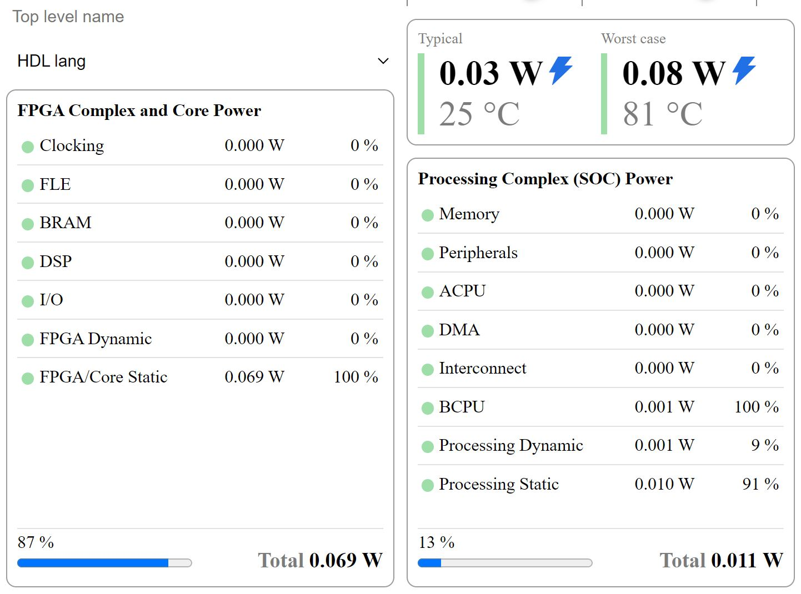
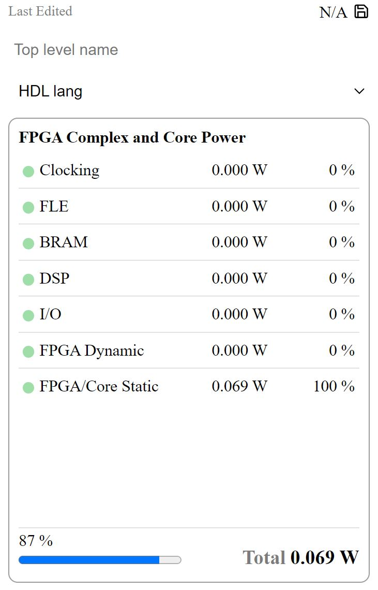
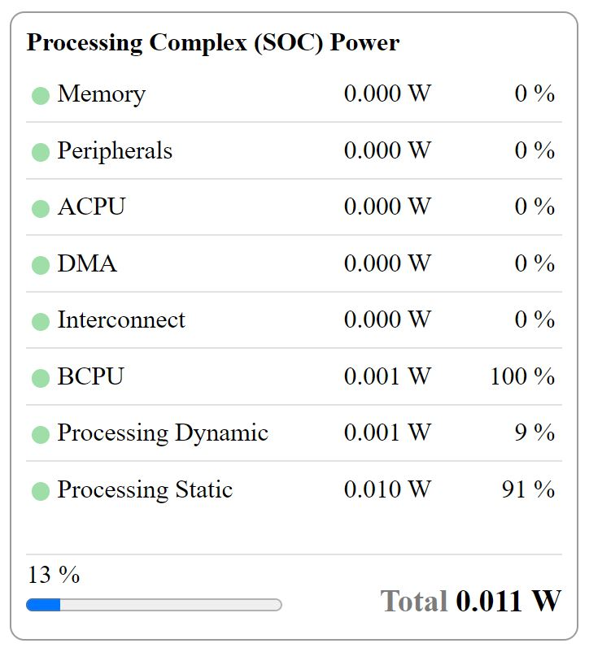
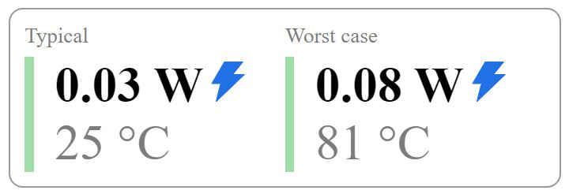

====================
Analyzing Results
====================

This section will document the results on Rapid Power Estimator.
The Rapid Power Estimator provides a comprehensive power data display on the right hand side of the user interface.

FPGA Complex & Core Power
#########################

The FPGA Power Data is displayed below the save icon and top level module input field.

The Display shows each FPGA input section label with 2 columns for power in watts & the percentage of power used by each respective part of the FPGA design.

The last 2 rows show FPGA Dynamic Power & FPGA Static Power. The power data in these rows is the sum of the respective static and dynamic power values from each of the FPGA input sections. 

At the bottom of the display, an overall percentage is given along with a percentage bar, this shows the percentage of power being used by the FPGA within the overall FPGA SoC.

Processing Complex (SoC) Power
##############################

The SoC Power Data is displayed on the far right of the screen, to the right of FPGA Power Data display. 

The display shows each SoC input section label with 2 columns for power in watts & the percentage of power used by each respective part of the SoC's Processing Complex.

The last 2 rows shows overall Dynamic & Static Power. The Power data in these rows is the sum of the respective static and dynamic power values from each of the SoC input sections. 

At the bottom of the display, an overall percentage is given along with a percentage bar, this shows the percentage of power being used by the Processing Complex within the overall FPGA SoC.

Overall Typical & Worst Case Power 
##################################

The Overall power budget numbers are displayed at the top right hand side of the screen, above the Processing Complex Power Display.

The displays show power in watts on a typical operating temperature of 25 degrees celcius as well as a power in watts on a worst case operating temperature of 81 degrees celcius. 

