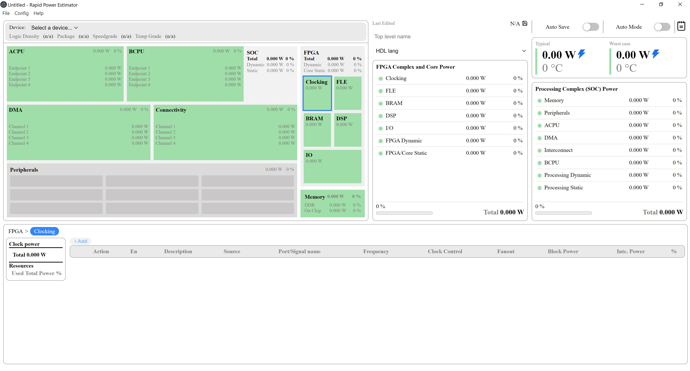
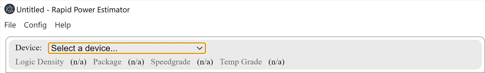
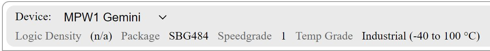
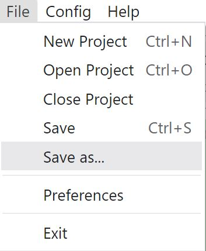
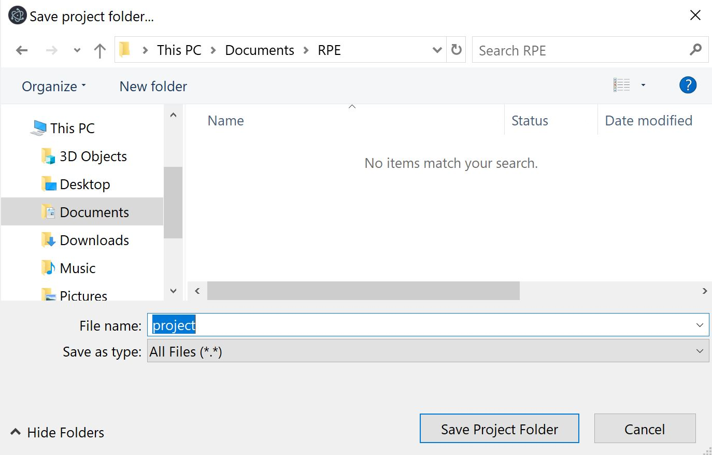
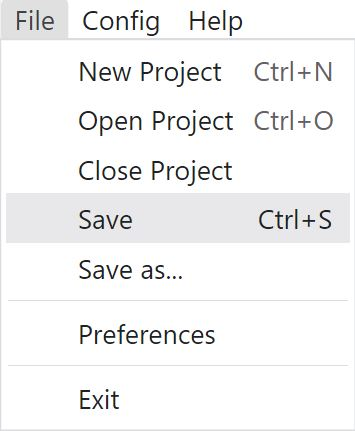
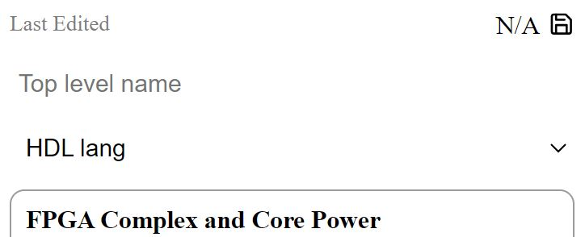
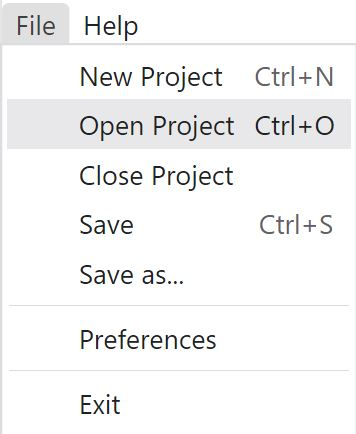
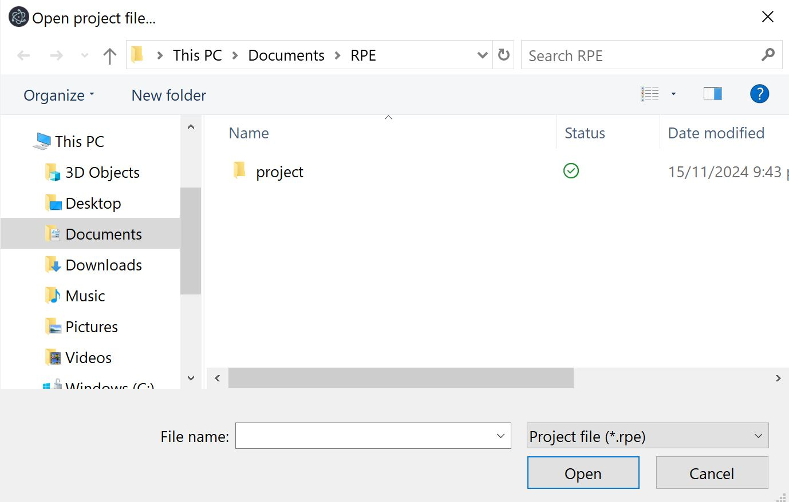
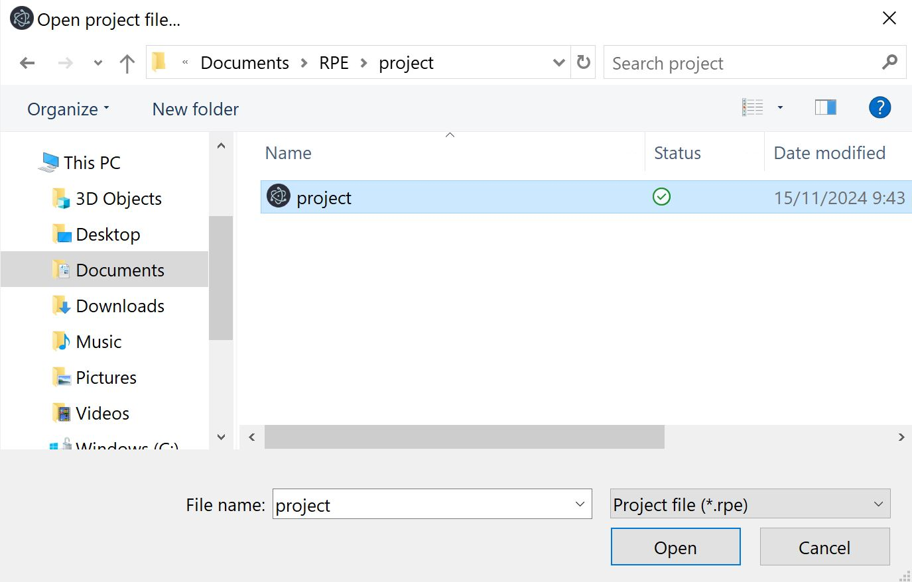

==========================
Setting up an RPE Project
==========================

This section will document how to setup a project on Rapid Power Estimator.

Launching RPE
##############

To launch the Rapid Power Estimator, simply navigate to your start menu and search for "Rapid Power Estimator". Once the application is found, click on the application icon to launch the tool.

The Rapid Power Estimator will display the following screen upon launch.

Device Selection
#################

The first step in beginning an RPE project is to select the FPGA device, once selected this device should not be changed during the project. 

To view the devices supported on RPE, click on the Device dropdown labelled "Select a device" on the top left of the screen.

Once a device is selected, logic density, package, spreedgrade and temperature grade range will be displayed. Check to make sure the selected device matches the one you plan to evaluate or currently are using with Raptor Design Suite.

Project Creation
#################

Once a device has been selected, it is reccommended to save the project before continuing. To save your work as a .rpe project, simply click the "file" tab on the top left of the window and click the "save as" option.

A window will be opened prompting the user to select a location to save the RPE project as well as provide a name for the project. After setting the location and name, click "Save Project Folder"

While working on the RPE project, the user can save their project's progress using either the save option under the file tab or the floppy disk save icon found above the FPGA Complex and Core Power display. 

In order to open an RPE project after closing and re-launching Raptor, the user should click the file tab and click on "Open Project"

The user will find their RPE project folder and inside find the .rpe project file. 

Select the project file, then click the open button on the window to open the project and continue working from where you left off. 